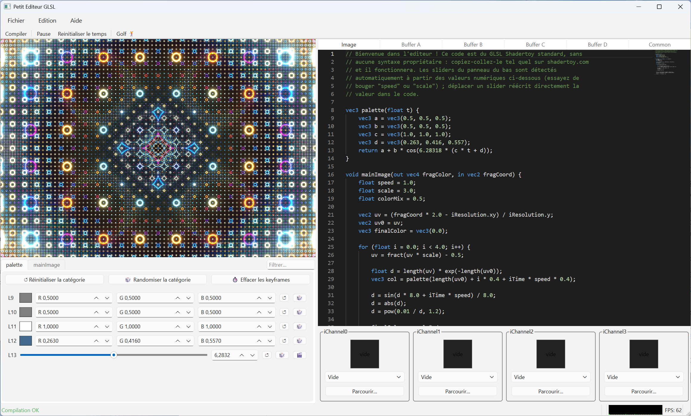
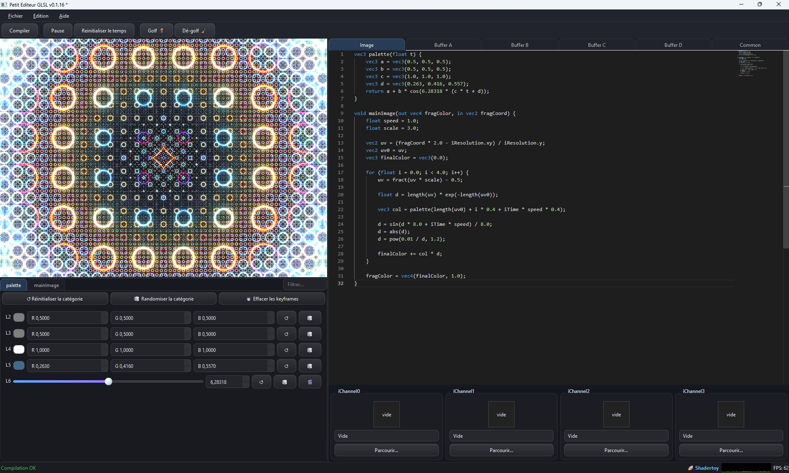

# Little GLSL Editor

A lightweight shader editor for Windows, designed for writing, tweaking, and testing real-time GPU-generated visual effects — the kind of effects found on [Shadertoy](https://www.shadertoy.com/). Fully compatible with Shadertoy code out of the box: no special syntax to learn.

**[⬇ Download Latest Version](../../releases/latest)**





## Features

### 🖊️ Live coding

- **Live Preview**: the rendering updates with every keystroke — no "compile" button to click.
- **Multi-pass Rendering** (Image + Buffers A through D, plus a shared Common tab) to build multi-stage effects that feed into each other, exactly like Shadertoy.
- **Full Shadertoy compatibility**: paste code from shadertoy.com as-is, no rewriting needed.
- **Import directly from Shadertoy** by pasting a shader's URL or ID — the shader, its buffers, and its textures are fetched and loaded automatically. (Requires a free Shadertoy API key, entered once and remembered for future imports.)

### 🎚️ Automatic Sliders

- Every numerical value in your code (colors, sizes, speeds, etc.) automatically becomes a draggable slider in a side panel, grouped by category, with a search field to quickly find one in a large shader.
- Vector values (`vec2`/`vec3`/`vec4`) are grouped into a single control — including a color picker for anything that looks like a color — instead of separate sliders per component.
- **Reset** and **randomize** buttons on each value, and on a whole category at once, for rapid exploration of variants.
- **Keyframe animation**: add keyframes to any slider at different points in time to animate a value over the course of the shader's playback, without writing any animation code by hand.
- Right-click a slider to fine-tune its range and decimal precision.

### 🎥 Inputs & Textures (iChannels)

- Load your own **images**, **video files**, or **audio files** (`.mp3`, `.wav`, `.ogg`, `.flac`) into an `iChannel`.
- Use your **webcam** as a live texture input.
- Drive sound-reactive shaders with an audio file's frequency spectrum and waveform, sampled exactly as on Shadertoy.
- Auto-generated procedural textures: checkerboard, white noise, value noise.
- 360° environment images (**cubemaps**, 6 faces) for reflections.
- Mouse (position, click) and keyboard input can drive your effect in real time.
- **Drag & Drop** an image, video, or audio file directly onto a texture slot.

### 🏌️ Code Golfing (minification)

- One-click tool to shrink your shader code down to the smallest possible byte count — ideal for code golfing competitions and demoscene 4k/8k intros.
- Fine-grained control over what golfing does: rename identifiers, remove unused functions, simplify algebraic expressions — each can be toggled independently.
- Can golf a single pass or the whole project (every pass + Common) at once.
- **Safety net**: if a golf pass would break compilation, it's automatically cancelled and your code is left untouched.
- **Undo the golf** at any time to get your readable code back.
- Live size readout in the status bar (raw bytes and estimated compressed size), with the traditional 2 KB / 4 KB / 8 KB demoscene thresholds highlighted.

### 📤 Export & Projects

- **Export a still frame** as a PNG image.
- **Export a video** as an `.mp4` file, with full control over duration, frame rate, output resolution, and compression (quality presets or an exact value), plus a file-size estimate before you export.
- **Export golfed (minified) shader code** as a standalone `.frag`/`.glsl` file.
- **Save and reopen full projects** (all passes, textures, and slider setups) as a single file, with a quick-access recent files list.

### 🌍 Interface

- Available in **12 languages**: English, Français, Deutsch, Español, Italiano, Português, 日本語, 한국어, 简体中文, हिन्दी, Norsk, Svenska — switchable anytime from *File → Preferences*.
- **Fully customizable keyboard shortcuts** for every command (see below), with live duplicate-binding detection and one-click reset.
- **Performance indicator**: a small graph displays the rendering frame time.
- **Preferences**: editor font size, minimap visibility, and live-preview update frequency, all adjustable to fit your machine and workflow.

## Installation

1. Click on **[⬇ Download Latest Version](../../releases/latest)** above (or go to the **Releases** tab of this repository).
2. Download the installer (`PetitEditeurGLSL-Setup-x.x.x.exe`) from the **Assets** section of the release.
3. Run the installer and follow the on-screen instructions.
4. Once installed, launch **Petit Editeur GLSL** from the Start menu.

> Requires 64-bit Windows and a compatible graphics card.

## Getting Started

1. Open the application: an example shader is already loaded and running.
2. Edit the code in the left panel — the preview on the right updates automatically.
3. Check out the sliders panel: every number detected in your code appears as a slider you can tweak without editing text directly. Use the search field at the top to find one quickly, and try adding a keyframe (right-click a slider) to animate a value over time.
4. Use the **Image / Buffer A / B / C / D / Common** tabs above the editor to build multi-pass effects.
5. Assign images, videos, audio files, your webcam, procedural textures, mouse input, or keyboard input to an `iChannel` slot using the panel to the right of the preview — or just drag and drop a file onto a slot.
6. Have a shader you like on shadertoy.com? Use **File → Import from Shadertoy…** and paste its link.
7. Once you're happy with the result, use the **File** menu to save your project, export a PNG screenshot, export an MP4 video, or export minified ("golfed") code.

### Default Keyboard Shortcuts

Every shortcut below can be changed from **Edit → Keyboard shortcuts…**.

| Action | Default Shortcut |
|---|---|
| Open a shader | Ctrl+O |
| Save the project as… | Ctrl+S |
| Quit | Ctrl+Q |
| Undo | Ctrl+Z |
| Redo | Ctrl+Y |
| Compile | F5 |
| Play / Pause | Space |

New, Open a project, Import from Shadertoy, Save as, the golf commands, and video/image/code export have no shortcut by default but can be bound to any key from the same dialog.

### Command-line batch tools

For power users, two commands also work outside the graphical interface (open a Command Prompt in the installation folder):

```
PetitEditeurGLSL.exe --golf shader.frag shader.min.frag [--no-rename] [--no-dead-code]
```
Golfs a single shader file without opening the app.

```
PetitEditeurGLSL.exe --export-mp4 project.json output.mp4 --duration 10 --fps 30 --crf 23 [--width 1920 --height 1080]
```
Renders a saved project straight to an `.mp4` file without opening the app — handy for batch-generating preview videos for a whole folder of shaders.

## Need Help?

Have a question, encountered a bug, or have a feature request? Feel free to open an [issue](../../issues) on this repository.

See [CHANGELOG.md](CHANGELOG.md) for a plain-language history of what changed in each version.

## License

Little GLSL Editor is **free**, but its source code is not provided.
See [LICENSE.md](LICENSE.md) for details on allowed and restricted usage.
